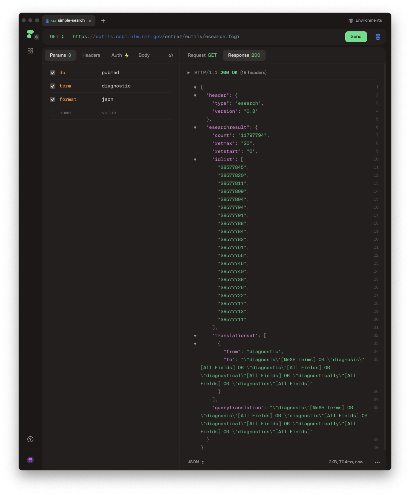
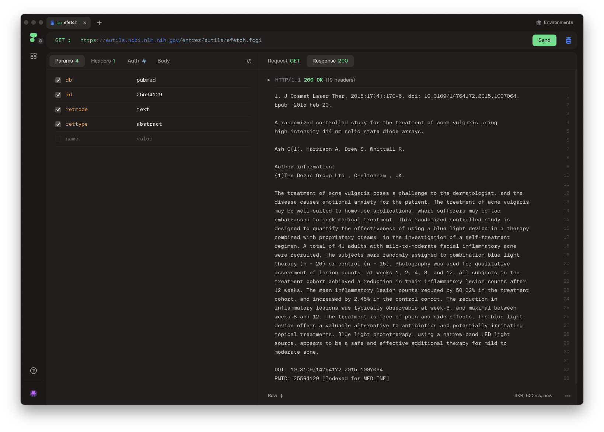
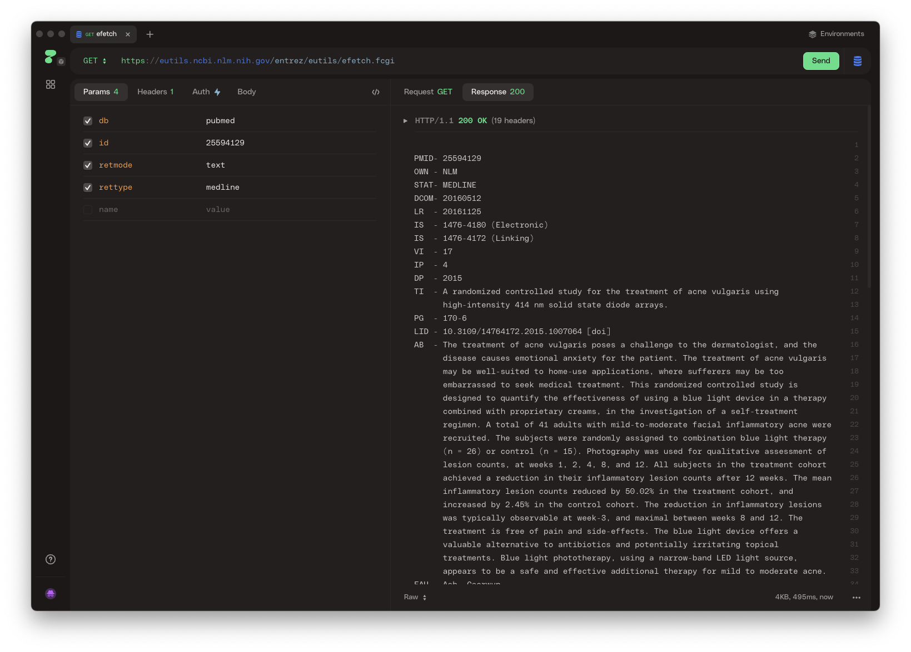

# 2.3 Using APIs via HTTPie

We've arrived at the fun part! In this section, we'll learn how to use APIs via HTTPie. HTTPie (https://httpie.io/) is a desktop application that allows you to interact with APIs using a comprehensive interface. It is a powerful tool that can help you quickly test and debug your API requests.

## Installation

You can download HTTPie from their website (https://httpie.io/desktop). It is available for Windows, macOS, and Linux.

You can also use HTTPie directly in your web browser by visiting their website (https://httpie.io/app).

## Using HTTPie

Let's jump straight in and see how we can search PubMed via the official Entrez API using HTTPie. If we read the [documentation](https://www.ncbi.nlm.nih.gov/books/NBK25499/#chapter4.ESearch) for the Entrez API about searching, we can see that the base URL endpoint for searching PubMed is `https://eutils.ncbi.nlm.nih.gov/entrez/eutils/esearch.fcgi`. We can also see that we can search PubMed specifically by specifying the database (`db`), the search term (`term`), and the format of the response (`format`). If we plug the URL and parameters into HTTPie, and perform a `GET` request, we can see the results:

HTTPie gives us a convenient interface to set the parameters, and make changes to the API request. However, your browser also makes `GET` requests to request web pages. You can put all these parameters for the request into a URL and visit the page in your browser and get the same results! If you click the link, you should get the same results as if you used HTTPie.

https://eutils.ncbi.nlm.nih.gov/entrez/eutils/esearch.fcgi?db=pubmed&term=diagnostic&format=json

## Requesting Studies using HTTPie

We can also explore how to get the text of individual studies using the `efetch` endpoint of the Entrez API. The [documentation](https://www.ncbi.nlm.nih.gov/books/NBK25499/#chapter4.EFetch) tells us that we need to specify the database (`db`), the PMID (`id`), and the format of the response (`retmode`). If we plug the URL and parameters into HTTPie, and perform a `GET` request, we can see the results: 

In the above figure, we can see that we are getting the abstract of a study with the PMID `25594129`. We can also get the abstract in a different format, like "medline" format, by changing the `rettype` parameter:

In the above figure, we can see that we are now getting all the data associated with that study, if we were to scroll down, it would have things like MeSH terms, publication information, and other metadata.

This endpoint does not provide responses in typical formats like JSON, so if we wanted to use this data in a program, we would have to parse the response ourselves. In [Section 3.2](../3-use-cases/3-2-searching-clinicaltrials-gov.ipynb), we'll do just that.

## Summary

In this section, we learned how to use APIs via HTTPie. We learned how to make requests to an API using HTTPie and how to interpret the responses. We also learned how to use HTTPie to test and debug our API requests.

Unfortunately though, HTTPie just lets us view the responses. In the next section, we'll learn how to use Python to interact with APIs and do more advanced things like data analysis and visualization.

---
[top](../README.md) 
[previous: Data formats](2-1-data-formats.md) 
[next: Using APIS via httpie](2-3-using-apis-via-httpie.md) 